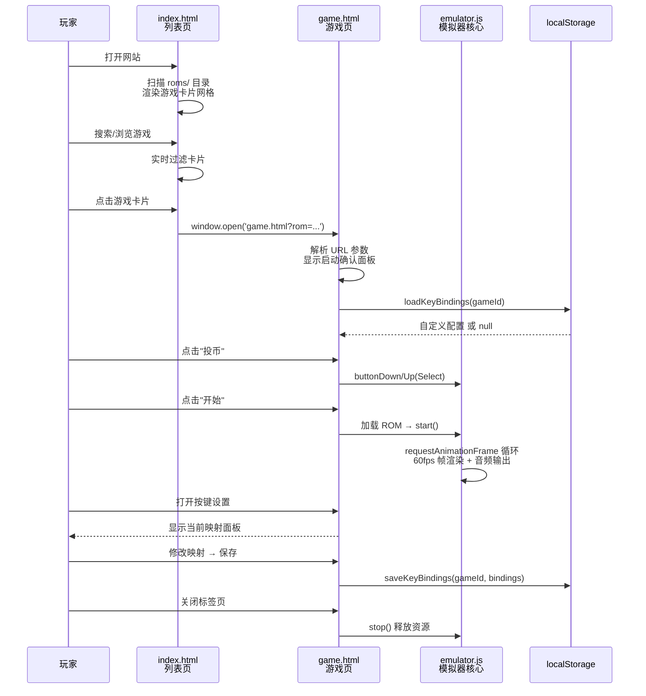
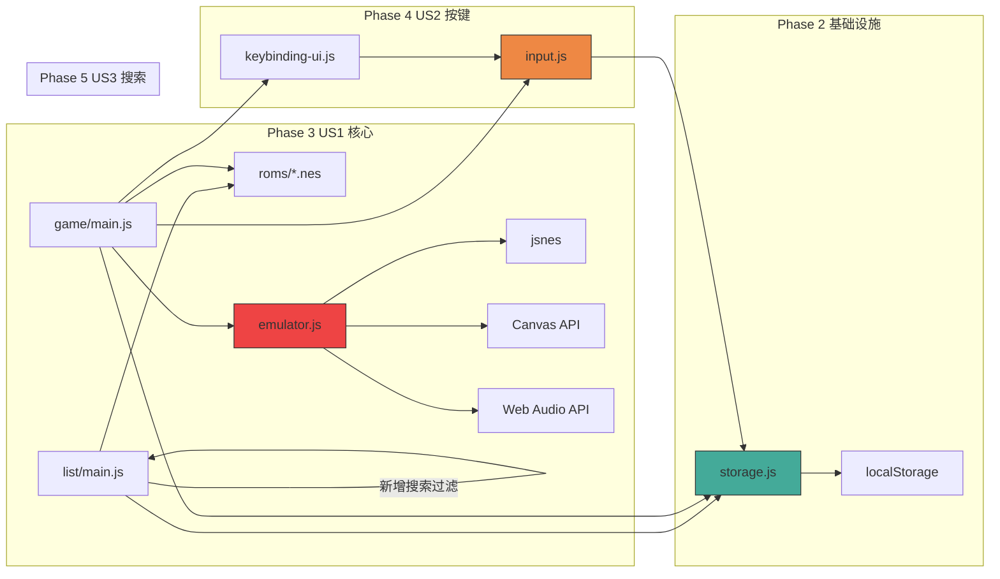
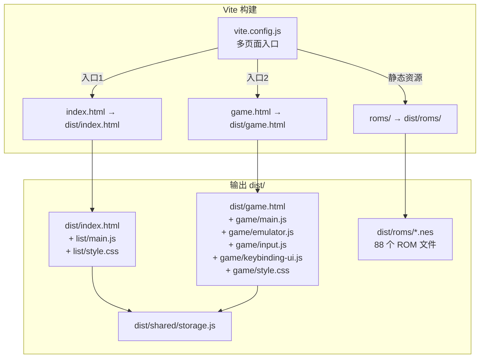

# 项目架构图

```mermaid
graph TD
    subgraph "入口层"
        A[index.html<br/>游戏列表页]
        B[game.html<br/>游戏运行页]
    end

    subgraph "列表页模块 src/list/"
        C[main.js<br/>列表渲染 / 搜索过滤<br/>卡片点击 → 新标签页]
        D[style.css<br/>网格布局 / 卡片样式]
    end

    subgraph "游戏页模块 src/game/"
        E[main.js<br/>生命周期管理<br/>URL解析 / 启动流程]
        F[emulator.js<br/>jsnes 封装<br/>帧循环 / 音频 / 输入]
        G[input.js<br/>按键映射<br/>默认配置 / 冲突检测]
        H[keybinding-ui.js<br/>设置面板 UI<br/>按键重新绑定]
        I[style.css<br/>Canvas布局 / 面板样式]
    end

    subgraph "共享模块 src/shared/"
        J[storage.js<br/>localStorage 封装<br/>loadKeyBindings<br/>saveKeyBindings<br/>resetKeyBindings]
    end

    subgraph "外部依赖"
        K[jsnes@1.2.1<br/>NES 模拟核心]
        L[ROM 文件<br/>roms/*.nes<br/>88 款游戏]
        M[localStorage<br/>浏览器存储]
        N[Canvas API<br/>画面渲染]
        O[Web Audio API<br/>音频输出]
    end

    subgraph "测试"
        P[tests/unit/<br/>input.test.js<br/>storage.test.js]
        Q[tests/e2e/<br/>list.spec.js<br/>game.spec.js]
    end

    A --> C
    A --> D
    C --> J
    C -->|window.open| B
    B --> E
    B --> I
    E --> F
    E --> G
    E --> H
    G --> J
    F --> K
    F --> N
    F --> O
    E --> L
    J --> M
    H --> G
    P --> G
    P --> J
    Q --> A
    Q --> B
```

## 数据流图



## 模块依赖关系



## 构建输出


